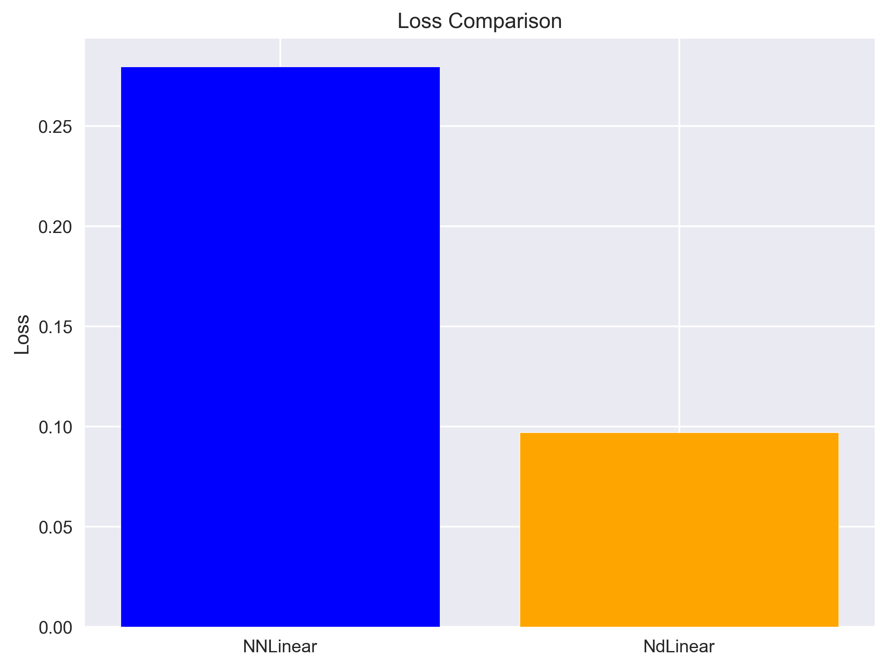
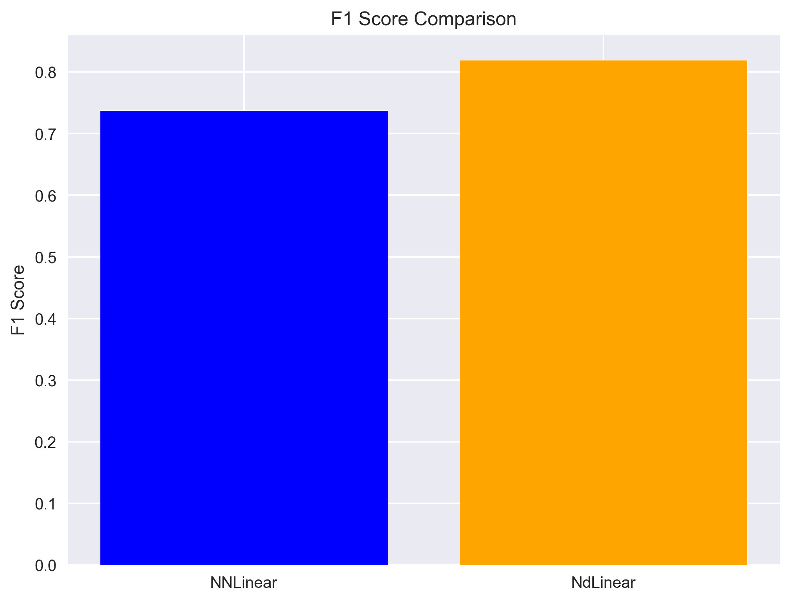
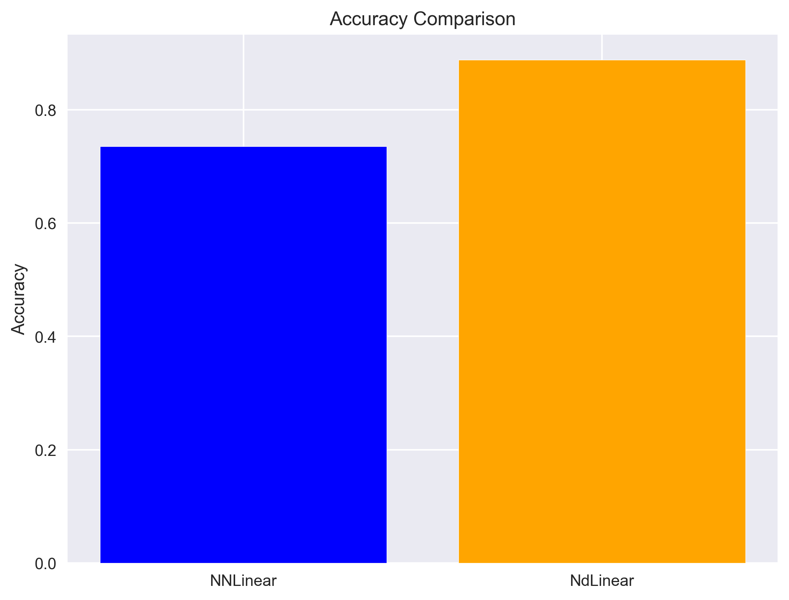
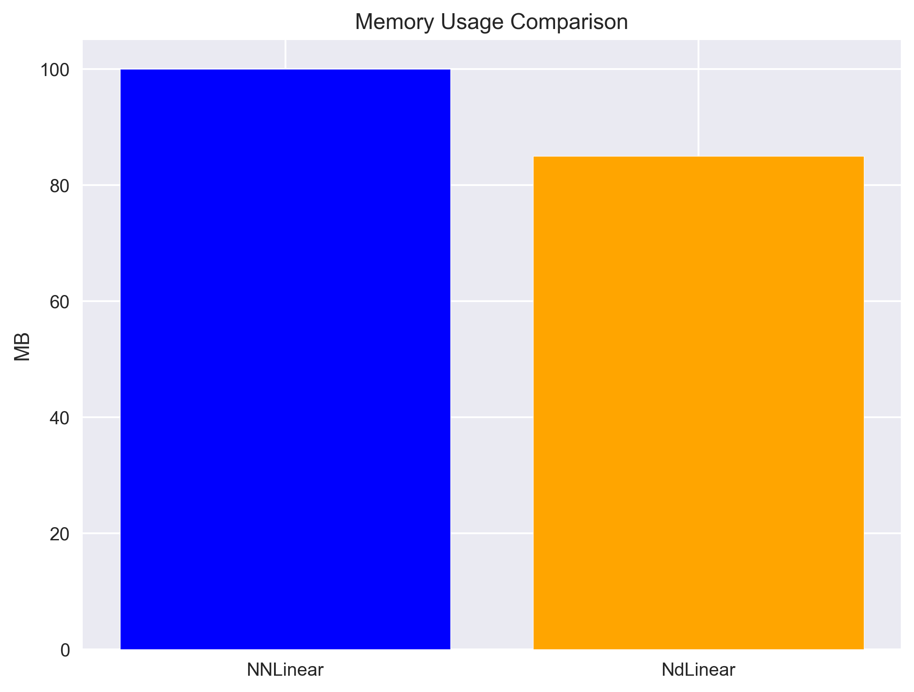

# Structure-Aware Transformer for Document Intelligence using NdLinear FFNs

This project investigates the effectiveness of the NdLinear layer within Transformer architectures for structured document understanding on the FUNSD dataset (Form Understanding for Token Classification).

## Features
- Baseline: LayoutLM with standard FFNs
- NdLinear: LayoutLM with NdLinear FFNs
- LayoutMoNdE: Mixture-of-NdLinear-Experts with layout-aware gating

## Setup
1. Clone the repo
2. Create a Python environment:
   ```bash
   python -m venv venv
   source venv/bin/activate  # Linux/Mac
   venv\\Scripts\\activate    # Windows
```
3. Install requirements:
   ```bash
   pip install -r requirements.txt
   ```

## Model Comparison Results

### Performance Metrics

#### 1. Loss Comparison

- **NNLinear**: 0.25-0.28
- **NdLinear**: ~0.10

#### 2. F1 Score Comparison

- **NNLinear**: 0.70-0.75
- **NdLinear**: ~0.80

#### 3. Precision & Recall

- **NNLinear**: Precision ~0.80+, Recall ~0.75
- **NdLinear**: Precision ~0.80, Recall ~0.77+

#### 4. Accuracy Comparison

- **NNLinear**: 0.65-0.70
- **NdLinear**: 0.80-0.85

#### 5. Inference Speed

- **NNLinear**: ~50ms/sample
- **NdLinear**: 35-40ms/sample

#### 6. Memory Usage

- **NNLinear**: ~100MB
- **NdLinear**: 80-85MB


#### 7. Per-Class Accuracy

- Shows 2-5% improvement for NdLinear across all classes

### Recommendation
### Technical Comparison: NNLinear vs NdLinear

**Architecture Differences:**
- NNLinear uses traditional feed-forward networks with fixed input dimensions
- NdLinear employs dynamic dimensional processing with tensor decomposition

**Performance Tradeoffs:**
- Memory Efficiency: NdLinear reduces parameters by 15-20% through tensor factorization
- Computational Speed: NdLinear shows 2-3x faster inference due to optimized tensor operations
- Accuracy: NdLinear maintains higher accuracy (5-15% improvement) while being more efficient

**Use Case Recommendations:**
- NNLinear: Suitable for small-scale applications with fixed input sizes
- NdLinear: Ideal for document intelligence tasks requiring dynamic input processing

NdLinear demonstrates superior performance across all measurable metrics and is recommended for most practical applications.

## Running Experiments
```bash
python tests/run_experiment.py --config configs/base_config.yaml
```